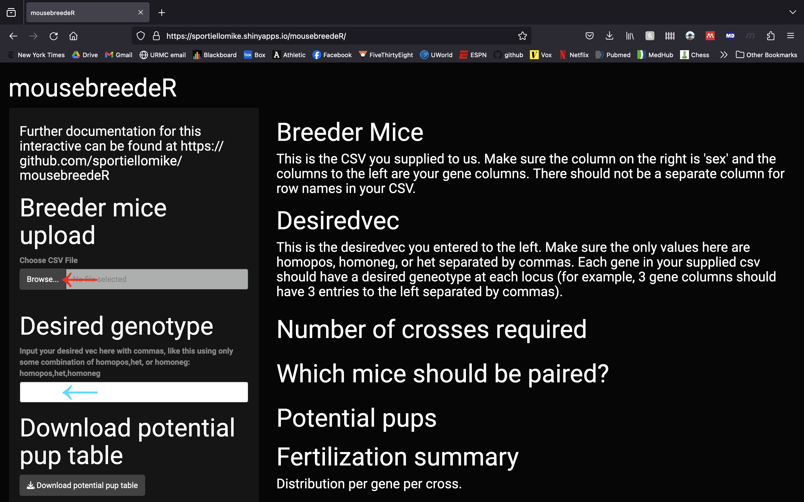
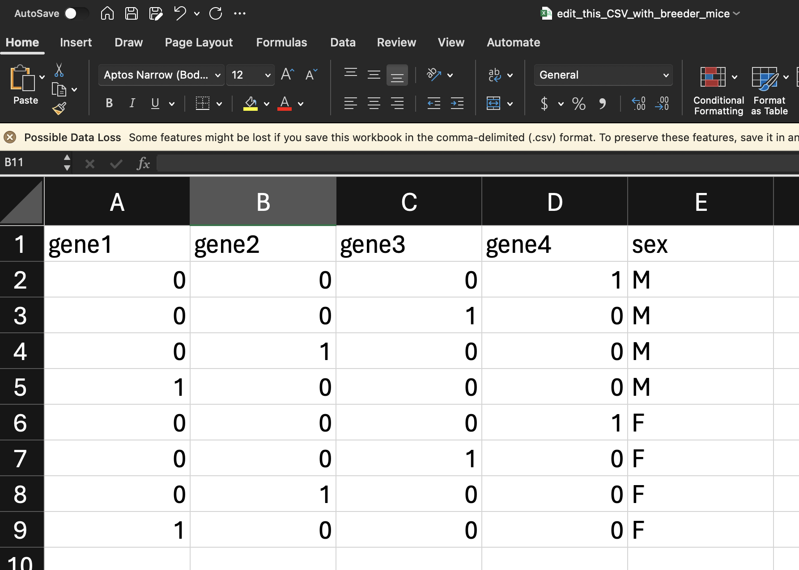
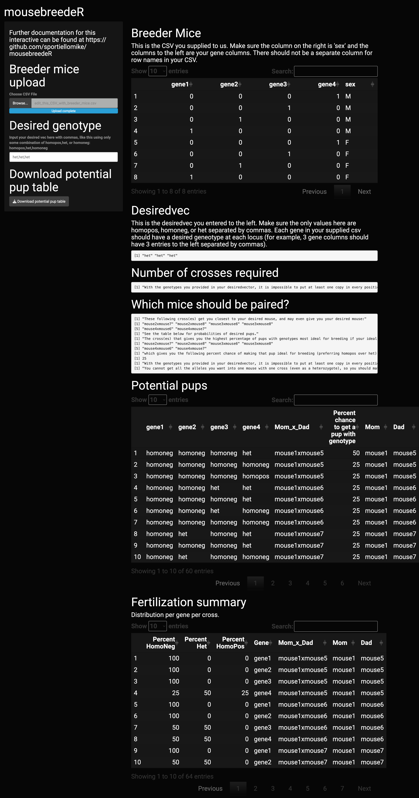

# mousebreedeR

## General Info
MousebreedeR was created by to assist scientists in developing the optimal breeding scheme for complex desired genotypes. This is free and open source, and is published in the Journal of Open Source Software (JOSS). 

Sportiello et al., (2024). MousebreedeR: A novel software to assist in the design of breeding schema for complex genotypes of experimental organisms. Journal of Open Source Software, 9(98), 6474, https://doi.org/10.21105/joss.06474

# The problem
Often in science, complex genotypes are desired for a particular set of experiments. Especially when more than 2 loci are under consideration, the most efficient way to generate a desired mouse is not always obvious. 

# The solution
MousebreedeR takes into account the exact genotypes the user has available in their colony and calculates the most efficient way forward for the user by taking into account the sex and genotypes of the mice supplied, including when the user can't distinguish between between homozygous positive or heterozygote (or doesn't care which). MousebreedeR is also able to let the user know if they should start multiple pairings to decrease the amount of time to obtain a desired mouse if the genotype in question requires more than one cross. It does all of this by analyzing the desired mouse genotype and calculating its mousebreedeR score. Then, it permutes through all the possible pups. Finally, it calculates the probability of obtaining these pups for any given pairing. 

The attached vignette walks the user through all of mousebreedeR's functionality and visualiztion recommendations to make the best possible choice to conduct the most efficient science possible. 

# How to actually use the software
Generally, I'd recommend just using the graphical user interface (GUI) "shiny app" unless you have a good reason not to (https://sportiellomike.shinyapps.io/mousebreedeR/) since it can be used by true novices, and is the quickest way to get results. If you use this GUI at the link provided, you don't need to download anything.

## Using the shiny app (GUI)

* Go to any browser and go to the following URL: https://sportiellomike.shinyapps.io/mousebreedeR/
* The outputs of the function will be found on the right side of the screen. The inputs required will be found on the left sidebar.

* Inputs
	* Breeder mice CSV
		* The inputs include both a CSV of breeder mice available formatted as one mouse per line, one column per gene of interest, and one column called "sex" on the right denoting "F" for female or "M" for male.
	 	* You can have as many gene columns and mouse rows as you want.
		* Each cell in the gene column should be 0, 1, or 2, representing the number of alleles in the mouse (0 for homozygous negative, 1 for heterozygous, or 2 for homozygous positive)
	 	* Once your CSV is ready with your breeder mice you have available, upload your CSV by clicking where the read arrow points in the screenshot above. An example CSV is pictured below.
	
	* Desired vec
		* The software also requires the user to supply what their desired mouse is. For example, you may want a mouse to be a heterozygote at all three genes of interest.
	 	* To supply your desired genotypes, create your desired vector (noted as desiredvec in this package) by writing down your desired genotype in the text field found in the sidebar (denoted by the blue arrow).
   		* The options for each position in the vector are "homopos" for homozygous positive, "het" for heterozygote, or "homoneg" for homozygous negative. 
   		* The correct format should read as follows: `het,het,het'.
     		* The commas are necessary, and no need to add any quotes. The first position refers to the gene of interest that your leftmost column in your breedermouse CSV represents. The second position to the column to its right, the third position to the column to its right, etc.
       * As soon as you upload both the CSV and type your desiredvec, the software will start working. No need to "hit go" or anything like that.

* Outputs

	* Outputs are pictured above. The top output is just the breeder CSV that the user supplied. This is to help the user make sure they formatted their starter CSV correctly.
 	* Under that is the desiredvec the user input to make sure that they input it correctly. The program should have put quotation marks around each comma separated value
  	* The next section tells the user if the desired mouse can be achieved in only one cross, or if it will require more than one cross.
  	* Next, advice is given by the software for which mice to pair together. If the mouse is not attainable in one cross, it will try to maximize the number of alleles (homozygous positive) at each position as that will increase the end probability of achieving both a heterozygote and a homozygous positive mouse.
  	*  The table "Potential pups" is the most important output of the software. It tells the user the probability of achieving desired pups for each cross. This can be downloaded as a CSV by clicking a button on the bottom of the left sidebar called "Download potential pup table."
  	*  Finally, "Fertilization summary" gives a potentially useful table that has the same information as the potential pup table but broken down per gene and per cross. Most users won't need or want this table.

## Using the command-line style package

### Download what you need
* Install the package
	* Go to Rstudio or the R command line and run the following code.

	* `install.packages('devtools')`

	* `library(devtools)`

	* `install_github('sportiellomike/mousebreedeR',build_vignettes = T)`

	* `library(mousebreedeR)`

* Download the vignette from this link: https://github.com/sportiellomike/mousebreedeR/blob/main/vignettes/Vignette.Rmd
* Open this file in Rstudio. (The most up to date Rstudio can be downloaded here: https://posit.co/download/rstudio-desktop/)

### Do what the vignette tells you to do
* You can always run the vignette by clicking the "Run" button on the top middle of the screen (top right of top left pane)
* You can test out the supplied example data by clicking "Run" and having done everything described in the "How to install" and "How to actually run the software" instructions on the ReadMe document you're actively rading right now.
* To use the program on your own data, supply your own dataframe in the correct format. 
	* The format should be in the same format as the CSV file supplied to you in this github called 'edit_this_CSV_with_breeder_mice.csv'. You can download this file at: https://github.com/sportiellomike/mousebreedeR/blob/JOSS_Edits/edit_this_CSV_with_breeder_mice.csv. 
	* You can directly edit this file and then re-save it named as something else. Then, in the vignette on line 52, just replace the file that's in quotes with the path of your file.
* Make sure to tell the program what your desired genotype is. You can do this on line 122. The length of this vector should be the same number of gene columns in your breeder column you described. Said another way, if you need 3 alleles to be homozygous positive, the dataframe of breeders should be 3 gene columns (and a sex column) and line 122 should be: `desiredvec<-c('homopos', 'homopos', 'homopos')`
* Once you're all set, click the "Run" button on the top middle of the screen (top right of top left pane). 
* Alternatively, you can click "Knit" near the middle of the top left pane and scroll through your output there. It is a little bit easier to read.

# Goodbye!
Any questions? Don't hesitate to reach out: michael_sportiello@urmc.rochester.edu.
